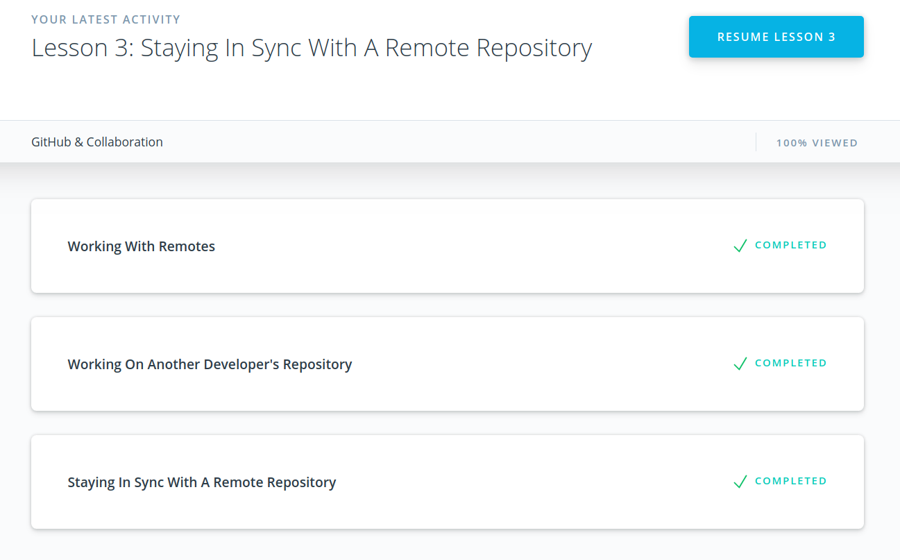
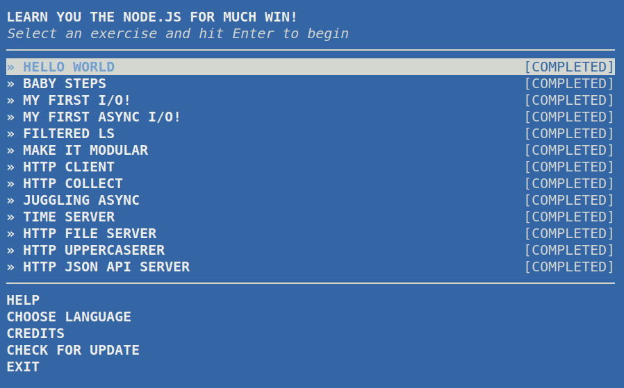
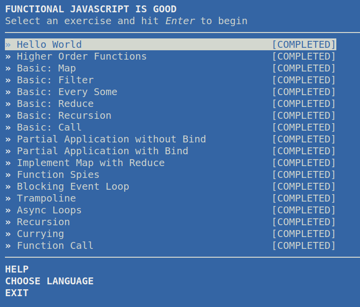
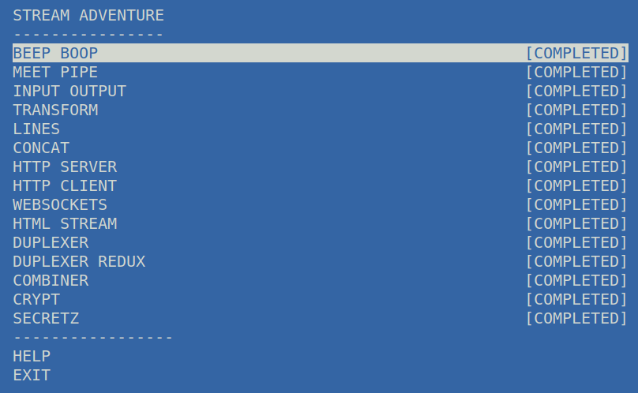

# kottans-backend

## Version Control with Git

### Git Commands Refresher

#### Nice course to refresh your Git knowledge.

**Show commit statistics**

```sh
$ git log --stat
```

**Display changes made to a file**

```sh
$ git log --patch
$ git log -p
```

**Ignore whitespace when comparing lines.**

```sh
$ -w
```

**Display most recent commit**

```sh
$ git show SHA
```

**Search commits by commit message**

```sh
git log --all --grep='Convert social links from text to images'
```

**Changes that have been made but haven't been committed, yet**

```sh
$ git diff
```

**Tag a commit**

```sh
$ git tag -a beta
```

**Delete a tag**

```sh
$ git tag -d beta
```

**Change Last Commit**

> will let you provide a new commit message

```sh
$ git commit --amend
```

- make changes to the necessary files
- save all of the files that were modified
- use `git add` to stage all of the modified files
- run git `commit --amend` to update the most-recent commit **instead of creating a new one**

**Undo Changes into a New Commit**

```sh
$ git revert <SHA-of-commit-to-revert>
```

**Show Detailed Log**

```sh
$ git log --oneline --graph --decorate --all
```

<details>
  <summary>Git Intro Completion Screen</summary>


</details>

## Git Collaboration

**Sync Remote Repo with Local**

> pushes changes to a remote

```sh
$ git push
```

**Sync Local Repo with Remote**

> pulls changes from a remote & merges into a local master

```sh
$ git pull
```

> If there are commits on the repository that you don't have but there are also commits on the local repository that the remote one doesn't have either, then
> use `git fetch` to prevent an automatic merge of the local branch with the tracking one.

**Check remotes**

```sh
git remote -v
```

<details>
  <summary>Git Collaboration Completion Screen</summary>



</details>

## Unix Shell

### What is the Shell?

The shell is a program that takes commands from the keyboard and gives them to the operating system to perform. In the old days, it was the only user interface available on a Unix-like system such as Linux. On most Linux systems a program called `bash` (which stands for Bourne Again SHell, an enhanced version of the original Unix shell program, sh, written by Steve Bourne) acts as the shell program.

 <details>
  <summary>Unix Shell Course Complete</summary>


</details>

### Below is a list of commands which I found worthy to note here.

**List commands with letters "spell"**

```sh
$ man -k spell
```

**Find files**

> first argument is where to start search

```sh
$ find ~ -name "poem*"
```

> Interesting!
>
> `cat` is the Linux command which means 'concatenation'.
>
> In fact, many people use `cat`, rather than `more`, to display the contents of a file. However, we do not recommend using `cat` in this way, since it is not nearly as useful as `more`.

**Send command output to a file**

> To send the output from a command such as `cat` to a file, use either `>` or `>>`.

- `>` - overwirtes file content
- `>>` - appends to file content

**Standard Input**

> Many commands can accept input from a facility called standard input.
> By default, standard input gets its contents from the keyboard, but like standard output, it can be redirected. To redirect standard input from a file instead of the keyboard, the "<" character is used like this:

```sh
$ sort < file_list.txt > sorted_file_list.txt
```

**Print two copies of a document to the default printer**

```sh
$ lpr -# 2 filename
```

**Check the print queue**

```sh
$ lpq -P <printerName>
```

**Show Disk Space in Home Directory**

```sh
$ df ~
```

**List All Running Processes**

```sh
ps aux
```

**Kill Process Immediately**

```sh
kill -9 PID
```

**Display Path to a Binary to Be Executed with a Command**

```sh
type code
```

## NodeJS Basics 1

> Honestly, I've been struggling to wrap my mind around streams, and I still am.
> I refuse to say I know something unless I understand all ins and outs of how something works internally.

> For example, we had to use the npm `through2` package, whereas I tried to solve the problems without it, alas, to no avail. I would really appreciate some more practical tasks to understand/refine my understanding of how streams work.

> I also had a hard time with a couple of tasks from the Functional JS Workshop, but I enjoyed solving them. My favorite ones include `currying`, `trampoline`, as well as binding `Array.prototype.slice` to `Function.prototype.call.` in order to create a function which acts like `slice`.

 <details>
  <summary>NodeJS Basic Courses - Screenshots</summary>





</details>
